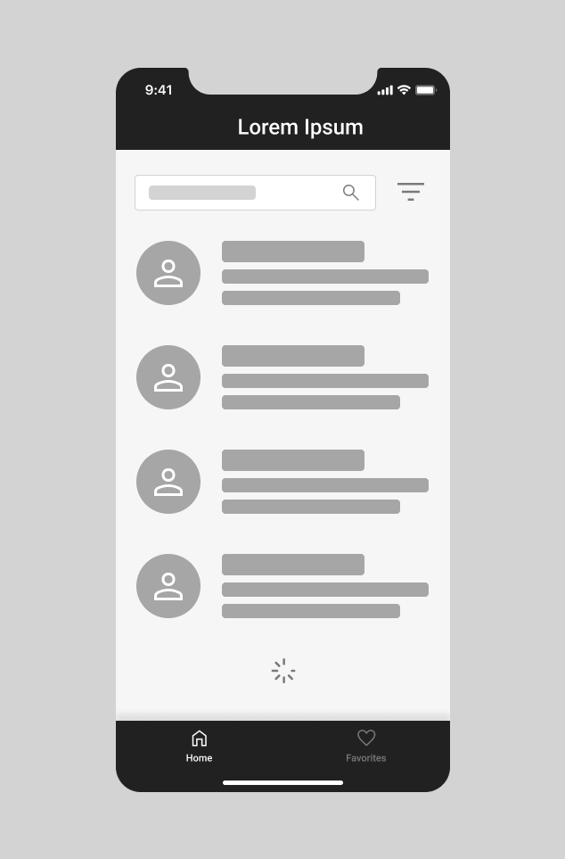
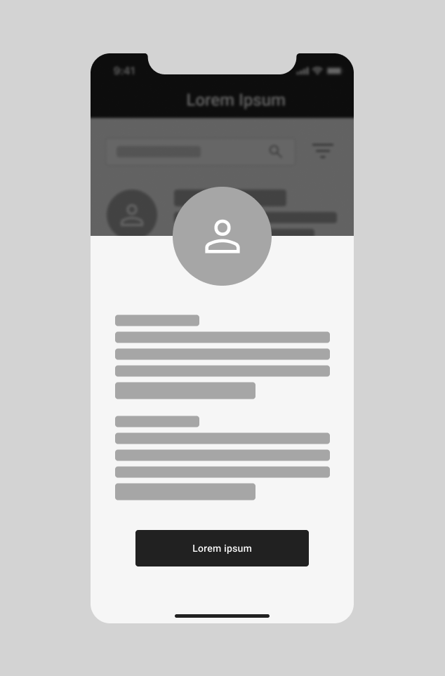
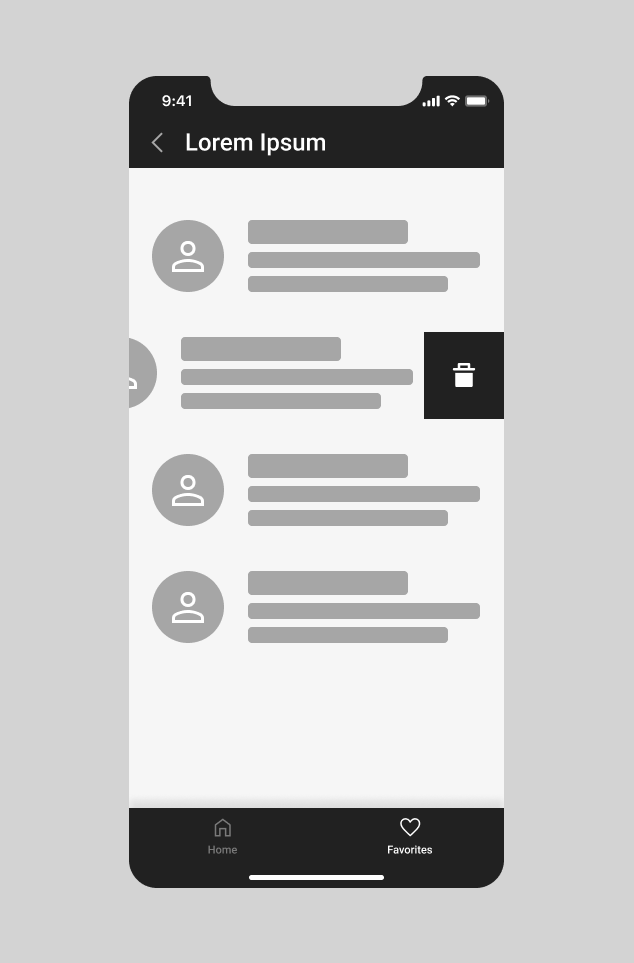

<h1 align="center" id="top">Alfred Mobile Challenge 🏅 2022</h1>

<p align="center">
 <a href="#introdução">Introdução</a> •
 <a href="#case">Case</a> •
 <a href="#recursos">Recursos</a> •
 <a href="#lista-de-pacientes">Telas</a> •
 <a href="#diferenciais">Diferenciais</a> •
 <a href="#instruções-de-entrega">Instruções de Entrega</a>
</p>

<div align="center">
    
</div>

## Introdução

Este é um desafio para testar seus conhecimentos em desenvolvimento Mobile;

O objetivo é avaliar a sua forma de estruturação e autonomia em decisões para construir algo escalável utilizando um framework moderno.
Você deverá usar **React Native** no desenvolvimento da solução deste tech challenge.

<p>As instruções de entrega e apresentação do challenge estão no final deste Readme 
 <a href="#instruções-de-entrega">⬇️</a>
</p>

## Case

A empresa Pharma Inc, está trabalhando em um projeto em colaboração com sua base de clientes para facilitar a gestão e visualização da informação dos seus pacientes de maneira simples e objetiva em uma aplicação onde podem listar, filtrar, favoritar e expandir os dados disponíveis.
O seu objetivo nesse projeto, é trabalhar no desenvolvimento da Aplicação end que consumirá a API da empresa Pharma Inc seguindo os requisitos propostos neste desafio.

## Recursos

1. Estudar a documentação da REST API: https://randomuser.me/documentation
2. Trabalhar em um [FORK](https://github.com/Alfredctba/alfred-mobile-challenge/fork) deste repositório em seu usuário ou utilizar um repositório em seu github pessoal (não esqueça de colocar no readme a referência a este challenge);
3. Logo da Marca: [Pharma Inc](assets/logo.png)
4. Cores para trabalhar no Projeto: [UI Colors](assets/colors.png)
5. [Wireframe](assets/screens.png) com as 4 telas principais.

---

## Lista de Pacientes

A tela inicial do projeto será um lista de pacientes que deverá conter um buscador para facilitar filtrar todos os que são exibidos na lista, proposta:



Para obter os dados, utilizaremos a API do Random User:

- https://randomuser.me/api/

Exemplo da resposta:

```json
{
   "results": [
       {
           "gender": "female",
           "name": {
               "title": "Ms",
               "first": "Alea",
               "last": "Christoffersen"
           }
       }
   ],
   "info": {
       "seed": "2f10116f1799d353",
       "results": 1,
       "page": 1,
       "version": "1.3"
   }
}
```

Além de realizar a request, devemos aplicar alguns filtros na API:

- Limitar em 50 resultados por request
- Utilizar um `Activity Indicator` para indicar que estamos carregando mais dados da API

---

## Visualizar Paciente

Para expandir a informação dos pacientes, teremos que adicionar o card como clicavél. Seguir o modelo proposto para o modal:



Devemos exibir os seguintes campos do paciente:

- Imagem
- Nome completo
- Email
- Gênero
- Data de nascimento
- Telefone
- Nacionalidade
- Endereço
- ID (Número de identificação)

No final do modal devemos ter botão para favoritar o paciente selecionado.

---

## Pacientes Favoritos

A tela de favoritos será uma lista com os pacientes adicionados aos favoritos, proposta:



Os dados exibidos na lista de pacientes favoritados deve ser os mesmos que a tela inicial.

---

## Diferenciais

Além do desafio proposto com as três telas, temos alguns diferenciais:

- Splash Screen;
- Utilizar Typescript;
- Componentização das interfaces;
- Poder remover pacientes da lista de favoritos;
- Configurar o buscador para poder filtrar por nacionalidade, gênero ou idade;
- Escrever Unit Tests na Lista de Pacientes. Escolher a melhor abordagem e biblioteca;

---

## Instruções de Entrega

#### Prazo

Você tera uma semana para entregar esse tech challenge.

#### Readme do Repositório

- Deve conter o título do projeto
- Uma descrição sobre o projeto em frase
- Deve conter uma lista com linguagem, framework e/ou tecnologias usadas
- Como instalar e usar o projeto (instruções)
- Nãoesqueça o `.gitignore`

#### Avisar sobre a finalização e enviar para correção.

1. Confira se você respondeu o Scorecard da Vaga que chegou no seu email;
2. Confira se você respondeu o Mapeamento Comportamental que chegou no seu email;
3. Acesse: [https://coodesh.com/challenges/review](https://coodesh.com/challenges/review);
4. Adicione o repositório com a sua solução;
5. Grave um vídeo, utilizando o botão na tela de solicitar revisão da Coodesh, com no máximo 5 minutos, com a apresentação do seu projeto. Foque em pontos obrigatórios e diferenciais quando for apresentar.
6. Adicione o link da apresentação do seu projeto no `README.md`.
7. Verifique se o Readme está bom e faça o commit final em seu repositório;
8. Confira a vaga desejada;
9. Envie e aguarde as instruções para seguir no processo. Sucesso e boa sorte. =)
